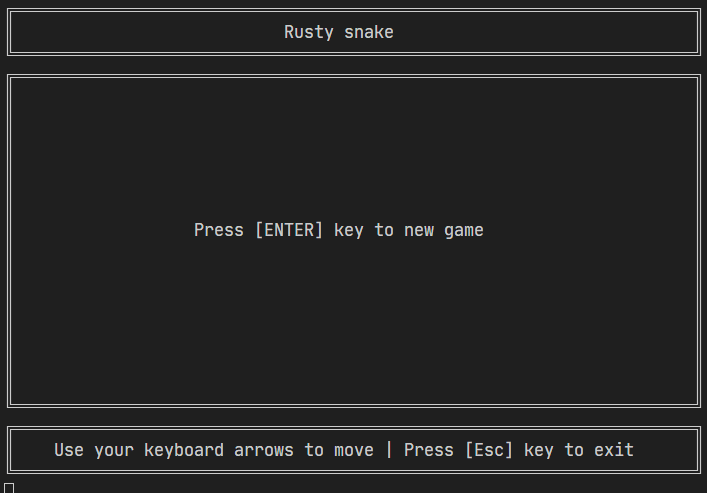

# Rusty snake

Classico jogo da cobrinha desenvolvido em rust para estudar a linguagem

## Comandos do jogo

- Pressione a tecla `Esc` para sair do jogo
- Pressione a tecla `Enter` para iniciar o jogo (No caso de estar no menu ou morto)

- Pressione as teclas de arrow do teclado para mover a cobrinha (`Left`, `Right`, `Up`, `Down`)

## Como rodar o projeto

- 1: Instale o rust
- 2: execute o comando `cargo run` e o jogo vai iniciar